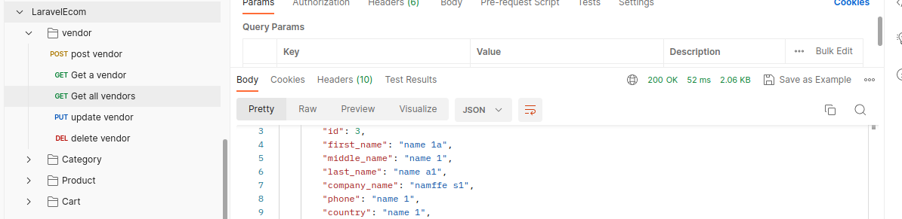

# Laravel Sample Ecommerce
This is a sample code to get started with ecommerce using laravel framework
It contains users, vendors, categories, products, and cart operations.

# Getting started
- Copy .env.example to .env
- Update database settings
- Run php artisan migrate to create database tables
- Run php artisan db:seed to seed Users to db
- <a href="LaravelEcom.postman_collection.json">Open the collection, adjust base url and run apis </a>
